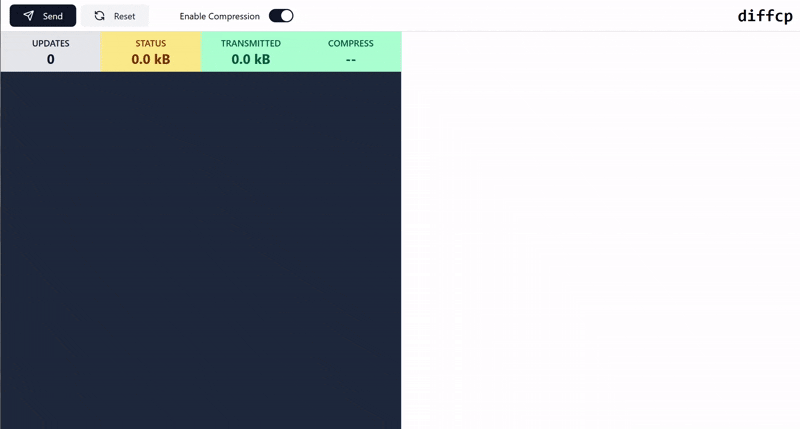

# ☄️ Diffcp - AI Streaming Protocol

<p align="center">
    
    
    
    
    <a href="LICENSE"></a>
</p>

Diffcp (Differential Context Protocol) is the new standard to stream AI Agent state to the user interface. Is a 
lightweight alternative to any bespoke AI protocol currently in the industry. Purpose built to be versatile
unopinionated and highly efficient (95%+ compression). It provides all the foundations:

- 🧠 **Kills complexity** → no more event orchestration logic
- 🧩 **One single model** → no events, no tool calls, just one state model
- ⚡ **Minimal over-the-wire cost** → highly optimized transmission
- 🔄 **Deterministic state convergence** → frontend always reflects backend truth
- 🛠 **Drop-in for any existing API** → same endpoint, same type, zero rewrites
- 🍔 **Zero dependency** → just raw speed

Today's “real-time” APIs especially in AI and chat are a pile of ad-hoc events; tokens, partials, tool calls, patches,
and retries, all in custom formats. Every system reimplements a fragile event interpreter or relies on opinionated and
limiting libraries. Every edge case leaks through. Differential Context Protocol replaces all of that with one core
idea: **evolving state**. No token streams, no custom event tax, and no frontend guesswork.

<p align="center">
  
</p>

## What it does

Turn any JSON API into a continuous state synchronization channel between backend and frontend. Instead of emitting a
zoo of custom events, the server streams compressed state diffs that progressively converge to the final value on the
client. The schema is fully defined by you, your API requires minimal modification, and it remains backward compatible.

## How Simple it is

You just need to shift your mental model: Stop streaming events about data, start streaming the data itself evolving.

On the server **yield updated state objects**

```ts
export async function* streamMessage(): AsyncIterable<MessageType> {
	yield { text: 'This' }
	yield { text: 'This is' }
	yield { text: 'This is a stream' }
	...
}

export function GET() {
	return new ObjectStreamResponse(streamMessage())
}
```

On the client **consume an updating state stream**

```ts
for await (const data of fetchObjectStream<MessageType>('/api')) {
	// Consume data
}
```

On in React **just render the value**

```tsx
const { value } = useObjectStream<MessageType>({
    url: '/api'
})
return <p>{value?.text}</p>
```

## Protocol

The protocol is designed to be a simple replacement to existing APIs without unnecessary developer burden, and without
breaking backward compatibility of the endpoint itself. Any existing API that is returning a JSON object of type `T` can
be extended with this protocol. The protocol streams a small set of event types to keep in synk the server-side state
`T` and the frontend-side state `T` until the request is completed. The protocol is extremely efficient and only
transmits a minified state diff via the network.

### Messages

The DCP protocol is abstracted into messages, and is only composed of 4 message types all composed by a `string` type
and a data payload.

| Type    | Data         | Description                                                                                                                                                                                                                                                                                                           |
|---------|--------------|-----------------------------------------------------------------------------------------------------------------------------------------------------------------------------------------------------------------------------------------------------------------------------------------------------------------------|
| `init`  | `T`          | Sends the complete state to the client, typically sent at the beginning of the stream, but can be skipped if the client already has a starting state. It can optionally be sent in between the stream to resync the state completely, useful to prevent state drift of more efficiently transmit large state changes. |
| `delta` | JSON diff    | [Delta update of the JSON](#json-diff) object containing one or many operations                                                                                                                                                                                                                                       |
| `done`  | Optional `T` | Indicates the end of the stream and can optionally carry a complete state, to resync the state completely to prevent state drift of more efficiently transmit large state changes.                                                                                                                                    |
| `event` | `any`        | Custom events that can be emitted during the stream and received by the client application. Events do not affect the state syncing in any way.                                                                                                                                                                        |

The messages protocol is carrier agnostic and can therefore support any message driven format and protocol. By default,
DCP uses a NDJSON streamed carrier.

### JSON Diff

JSON diffs or deltas are described as a set of operations with a compact notation inspired
by [JsonPatch](https://jsonpatch.com/). Here only add, remove, and replace are supported, but **string appending** is
introduced which for obvious reasons is very important for AI applications. The diff format is compact and comprised of
3 operations.

| Type | Operation    | Description                                            |
|------|--------------|--------------------------------------------------------|
| `s`  | Set value    | Sets the value indicated by the path                   |
| `a`  | Append value | Appends to the array or a string indicated by the path |
| `d`  | Delete value | Deletes the value indicated by the path                |

An example of the protocol looks like this:

```json5
[
  [
    // set a field
    "s",
    "/duration",
    8.511631965637207
  ],
  [
    // set a nested field
    "s",
    "/parts/0/state",
    "done"
  ],
  [
    // append to a string
    "a",
    "/parts/0/body/-",
    " a more focused iteration cycle for upcoming experimental model variants."
  ]
]
```

### NDJSON Carrier

The protocol is implemented via a new-line separated JSON stream https://ndjson.com/ over HTTP. Similarly to the SSE
standard this protocol can be used as a response to any HTTP request (GET, POST, ...) denoted with the
`application/x-ndjson` MIME type. Messages are formatted in the form `{t: string, d: any }`

```text
{ t: 'init', d: { ... }}  // set the initial value
{ t: 'delta', d: [ ... ]}  // change it via delta operations
{ t: 'delta', d: [ ... ]}
...
{ t: 'init', d: { ... }}  // set a new plain value
{ t: 'delta', d: [ ... ]}
...
{ t: 'done' }  // complete the stream
```

> [!TIP]
> Empty lines and objects not matching the defined signature are ignored. JSON parsing errors will cause the request to
> fail.

### 🚧 MessagePack Carrier

This is a work in progress

### Wht not SSE?

The SSE protocol has been created to support server to client event streaming. Is ideal to keep a serer-to-client
channel open, but as such the technology surrounding it is not ideal for the application.

First of all, browser provided `EventSource` clients are not designed to perform user initiated requests and only expect
a streamed update. They often include retries and auto-reconnect logic which do introduce unexpected or unwanted
behaviours. The same clients do not allow for arbitrary HTTP operations, they typically only support GET.

Given standard clients are not suitable for the use case and may also introduce security vulnerabilities in any case
custom `fetch` base solutions have to be implemented. For this reasons SSE has been ruled out as a "better to avoid"
protocol.

> [!TIP]
> The protocol remains compatible and SSE can be used as a carrier without problems.
